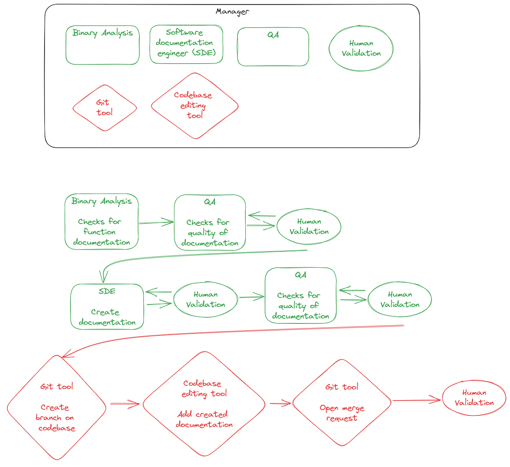

## Overview

In the life cycle of software development nearly 90% of effort is used for understanding a maintenance task and related software source code. This means that documentation that provides a high level description of tasks performed by code can have a huge impact in minimizing such maintenance tasks. The problem is that such detailed descriptions are labor-intensive tasks and are a feature that do not deliver immediate value to project managers or product owners. This toy sample aims to demonstrate how automated tools can assist in generating documentation, specifically docstrings, for new functions in code, thereby reducing the time and effort required for maintenance.


### Description

This project contains a script (`main.py`) that processes text files containing git diffs, detects new functions without docstrings, and generates appropriate docstrings for them using the `ollama` library. Additionally, it leverages AI agents to automate various tasks related to documentation.

The `main.py` script performs the following tasks:

1. **Lists Files in the Directory**: It lists all files in the `./files` directory.
2. **Reads and Decodes Files**: For each file, it reads the raw data, detects the encoding using `chardet`, and decodes the data.
3. **Extracts New Lines**: It extracts lines that start with a "+" (indicating new lines in a git diff).
4. **Generates a Prompt**: If there are files, it generates a prompt for the `ollama` model to analyze the new code and identify functions without docstrings.
5. **Generates Docstrings**: It uses the `ollama` model to generate docstrings for the identified functions and prints the response.
6. **AI Agents**: Utilizes AI agents to write, check, and evaluate the quality of documentation, ensuring comprehensive and high-quality docstrings.


## Goal

The goal of this sample is to automate generation of descriptive documentations. The green are implemented functionality, red are features to be added



### Usage

To run the script, install required packages then, execute the following command in your terminal:

python main.py

## Result

### Running:
```PS C:\Users\skaoi\Code\toy-sample> python .\main.py```

### Input data:
```
['./files\\diff.txt']
['+++ b/main.py\n+def get_house_finance_data(sheet) -> str:\n+    # Get data from the Google Sheet\n+    salario_douglas, salario_luana, salario_total = (\n+        sheet.cell(6, 13).value,\n+        sheet.cell(7, 13).value,\n+        
sheet.cell(8, 13).value,\n+    )\n+    percent_douglas, percent_luana, percent_total = (\n+        sheet.cell(6, 14).value,\n+        sheet.cell(7, 14).value,\n+        sheet.cell(8, 14).value,\n+    )\n+    contri_douglas, contri_luana, contri_total = (\n+        sheet.cell(6, 15).value,\n+        sheet.cell(7, 15).value,\n+        sheet.cell(8, 15).value,\n+    )\n+    # Convert all values to strings for display\n+    data = [\n+        ("Douglas", salario_douglas, percent_douglas, contri_douglas),\n+        ("Luana", salario_luana, percent_luana, contri_luana),\n+        ("Total", salario_total, percent_total, contri_total),\n+    ]\n+\n+    # Format as a table\n+    table = f"{\'Name\':<10} {\'Salary\':<15} {\'Percent\':<10} {\'Contribution\':<15}\\n"\n+    table += "-" * 50 + "\\n"\n+    for row in data:\n+        table += f"{row[0]:<10} {row[1]:<15} {row[2]:<10} {row[3]:<15}\\n"\n+\n+    return table']
```
### Output:

Based on the provided git diff, there is one new function implemented:
```python
def get_house_finance_data(sheet) -> str:
```

This function does not have an accompanying docstring. Below is a suggested docstring to help explain its purpose and usage:

```python
def get_house_finance_data(sheet) -> str:
    """
    Retrieves financial data from a specified Google Sheet and formats it into a table.

    This function extracts specific salary, percentage, and contribution data for
    'Douglas', 'Luana', and the total from given cells in a Google Sheet. It then
    organizes this information into a tabular format and returns it as a string.

    Parameters:
    - sheet: An object representing the Google Sheet containing the financial data.

    Returns:
    - str: A formatted table as a string displaying names, salaries, percentages,
      and contributions for Douglas, Luana, and the total.
    """
```

This docstring provides an overview of what the function does, its parameters, and its return value.

## Improvment backlog
- [ ] Add [Guardrails](https://docs.crewai.com/concepts/tasks#task-guardrails) to tasks
- [ ] Use [pydantic](https://docs.crewai.com/concepts/tasks#using-output-pydantic) to get structured and consistent outputs
- [ ] Search for or implement a git tool to be able to create branches, open merge requests etc.
- [ ] Tool for editing codebase, adding created docstring to function.
- [ ] Improve performance
